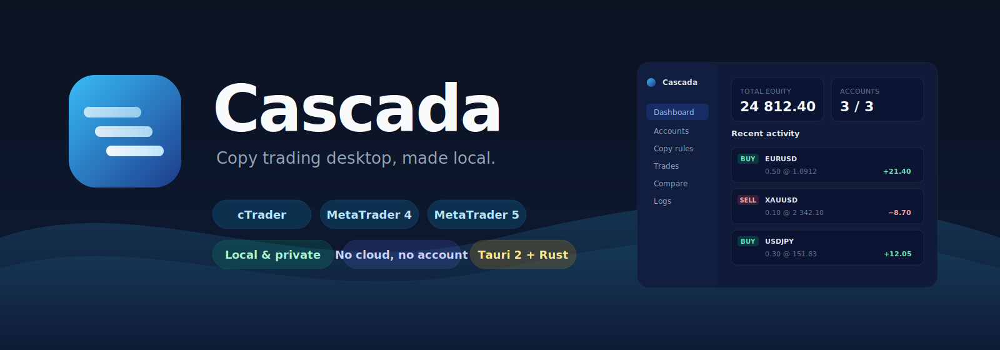

<p align="center">
  
</p>

<h1 align="center">Cascada</h1>

<p align="center">
  <strong>Free, local-first copy trading for cTrader, MT4 and MT5 — on your own machine.</strong><br/>
  <em>No cloud, no subscription, no API keys handed over. One desktop app. Your accounts, your trades, your data.</em>
</p>

<p align="center">
  <a href="https://github.com/flocom/Cascada/releases/latest"></a>
  <a href="https://github.com/flocom/Cascada/actions/workflows/release.yml"></a>
  
  
</p>

<p align="center">
  <a href="#download">Download</a> ·
  <a href="#features">Features</a> ·
  <a href="#how-it-works">How it works</a> ·
  <a href="#quick-start">Quick start</a> ·
  <a href="#faq">FAQ</a>
</p>

---

<a id="download"></a>
## ⬇️ Download

Pick the installer for your OS. Binaries are built and published automatically for every tagged release.

| Platform | Installer | Notes |
|----------|-----------|-------|
| 🍎 **macOS (Apple Silicon + Intel)** | [**Cascada.dmg**](https://github.com/flocom/Cascada/releases/latest) | Universal binary. First launch: right-click → *Open*. |
| 🪟 **Windows 10 / 11 (x64)** | [**Cascada-setup.exe**](https://github.com/flocom/Cascada/releases/latest) / [`.msi`](https://github.com/flocom/Cascada/releases/latest) | SmartScreen may warn on first run — *More info* → *Run anyway*. |
| 🐧 **Linux** | [**.AppImage**](https://github.com/flocom/Cascada/releases/latest) / [`.deb`](https://github.com/flocom/Cascada/releases/latest) | AppImage is portable; `.deb` for Debian/Ubuntu derivatives. |

> Don't see a platform? Head to [Releases](https://github.com/flocom/Cascada/releases) — every build artifact is attached there.

<a id="running-an-unsigned-build"></a>
### 🔐 Running an unsigned build

Cascada is built by GitHub Actions without paid code-signing certificates (Apple Developer ID, Windows Authenticode). Your OS will warn you on first launch — here's how to trust the app once:

#### 🍎 macOS — *"Cascada.app cannot be opened because Apple cannot check it for malicious software"*

**Easiest:** right-click (or *Ctrl* + click) on `Cascada.app` in Finder → **Open** → confirm **Open** in the dialog. Done once, macOS remembers.

**If Gatekeeper blocks completely** (*"app is damaged"* on macOS 15+, quarantine attribute):

```bash
xattr -d com.apple.quarantine /Applications/Cascada.app
```

**To silence the "would like to access data from other apps" prompt:**
System Settings → **Privacy & Security** → **Full Disk Access** → **+** → add `Cascada.app`. Required so Cascada can discover MT4/MT5 terminals installed via Wine, Bottles, or CrossOver.

#### 🪟 Windows — *"Windows protected your PC"* (SmartScreen)

Click **More info** on the blue dialog → **Run anyway**. That's it.

If your antivirus is aggressive and deletes the installer, add the download folder to your AV exclusions temporarily, re-download, install, then you can remove the exclusion.

#### 🐧 Linux — AppImage

```bash
chmod +x Cascada_*.AppImage
./Cascada_*.AppImage
```

`.deb` / `.rpm` install through the usual `dpkg -i` / `rpm -i`.

**Verify integrity** — every release assets has a `.sig` sidecar generated by GitHub Actions you can cross-check against the workflow logs; the source is 100% on GitHub and the build is reproducible.

---

<a id="features"></a>
## ✨ Features

### 🔌 Multi-broker, multi-platform
- **cTrader** — drop-in cBot (`CascadaBridge.algo`) installed automatically into your cAlgo folder.
- **MetaTrader 4** — Expert Advisor (`CascadaBridge.mq4`) with auto-discovery of every MT4 terminal on your machine (Wine, Bottles, CrossOver, PlayOnMac, native installs).
- **MetaTrader 5** — same story with `CascadaBridge.mq5`.
- **Multiple masters and slaves in parallel** — mix platforms freely (MT4 master → cTrader slave, etc).

### 🎯 Copy-rule engine
Every master→slave link is a **rule** with fine-grained control:
- **Lot sizing** — Fixed · Multiplier · Equity-ratio · Balance-ratio · Risk % (SL-based).
- **Min / max lot clamp** · per-symbol step normalization.
- **Direction filter** — all / buy-only / sell-only.
- **Symbol whitelist / blacklist** · **prefix / suffix mapping** (EURUSD → EURUSDm).
- **Per-symbol quote-offset** to compensate slave broker quote drift (pips shift on SL/TP).
- **SL / TP shaping** — copy · ignore · fixed pips.
- **Max open positions** · **max exposure (lots)** · **max daily loss** caps.
- **Comment filter** (copy only trades with matching EA / strategy tag).
- **Skip trades older than N seconds** (catch-up protection on reconnect).
- **Schedule window** — broker-time session start/end, weekends skip.
- **Per-rule trade delay** (jitter dispatch across slaves).
- **Reverse mode** (Buy → Sell).

### 📊 Dashboard & observability
- **Live KPIs** — total equity, connected accounts, active rules, open positions.
- **Recent activity stream** with per-trade P/L, master↔slave mirror attribution.
- **Accounts tree** — drag slaves under masters to link them; color-coded groups per master.
- **Compare tab** — side-by-side bid/ask and spread for the same symbol across brokers, with pip-distance live.
- **Trades tab** — virtualised list (handles thousands of trades without lag).
- **Logs tab** — full connector trace, filterable.

### 🔒 Local-first by design
- **No cloud.** State lives in a single local `state.json`. Your EA installs talk to the app via local file bridges — no sockets open to the internet.
- **No account login to Cascada.** You install once, the app auto-discovers your terminals.
- **No telemetry.** Zero outbound network calls beyond what the broker APIs need.
- **Export / import** your settings (accounts + rules) as a signed JSON bundle — perfect for backups or migrating between machines.

### 🚀 Built for speed
- **Tauri 2 + Rust** core → ~20 MB installer, <50 MB RAM at rest.
- **Quote hot path** is zero-alloc; tick streams from all accounts merged into a single reactive store.
- **Adaptive polling** on the file bridge (100 ms → 1 s backoff when silent).
- **Persistent readers**, `Arc`-shared trades, zero-clone snapshot saves, rAF-batched UI updates.

---

<a id="how-it-works"></a>
## 🏗 How it works

```
┌─────────────┐   file bridge (JSONL)      ┌──────────────────┐
│  MT4 / MT5  │──────────────────────────▶ │                  │
│  Expert     │ ◀──────────────────────────│                  │
│  Advisor    │   Common/Files/Cascada/    │   Cascada core   │
└─────────────┘                            │      (Rust)      │──▶ Svelte UI (Tauri 2)
┌─────────────┐   file bridge (JSONL)      │                  │
│  cTrader    │──────────────────────────▶ │   copy engine    │
│  cBot       │ ◀──────────────────────────│                  │
└─────────────┘   ~/cAlgo/Cascada/…        └────────┬─────────┘
                                                    ▼
                                            local state.json
```

1. **Master** opens a trade → broker EA writes a framed JSON event to a per-login `events.jsonl`.
2. **Cascada core** watches each file, parses, and runs the matching enabled rules.
3. **Volume / SL / TP / symbol** are shaped per rule, then a command JSON is appended to the slave's `cmd.jsonl`.
4. **Slave EA** reads, dispatches the order, and writes its own confirmation back.

No TCP sockets, no DLL, no admin privileges — just a shared folder the EAs and Cascada both read/write.

---

<a id="quick-start"></a>
## 🚴 Quick start

### 1. Install
Download the installer for your OS from [Releases](https://github.com/flocom/Cascada/releases/latest) and run it.

### 2. Connect your first platform
Launch Cascada → **Accounts** tab → **+ Connect platform** → pick cTrader / MT4 / MT5.

#### cTrader
- Click **Auto-install cBot** — Cascada copies `CascadaBridge.algo` into your `~/cAlgo/Sources/Robots/`.
- Open cTrader → Automate → add the cBot to a chart → **Start**.
- Your account appears in Cascada automatically.

#### MT4 / MT5
- Click **Auto-install Expert Advisor** — Cascada discovers every MT4/MT5 terminal on your machine (even inside Wine/Bottles/CrossOver/PlayOnMac) and drops `CascadaBridge.mq4` / `.mq5` into each `MQL4/Experts/` (or `MQL5/Experts/`).
- In MT4/MT5: refresh Navigator → drag `CascadaBridge` onto any chart → enable **AutoTrading**.
- Account appears in Cascada.

### 3. Link a master to slaves
- Click **Make master** on one account.
- Drag another account onto it, or use the **Attach as slave** button.
- Open **Copy rules** → tune sizing, filters, caps, schedule.
- Active, done. Any trade the master fires copies to linked slaves per your rule.

---

## 🔧 Build from source

```bash
git clone https://github.com/flocom/Cascada.git
cd Cascada
npm install
npm run tauri:dev       # hot-reloading dev app
npm run tauri:build     # release bundle for current OS
```

Requirements: Node 20+, Rust stable, platform-specific Tauri prerequisites ([docs](https://v2.tauri.app/start/prerequisites/)).

---

## 🗺 Project layout

```
Cascada/
├── src/                     # Svelte + TypeScript UI
│   ├── App.svelte
│   ├── components/          # Dashboard, Accounts, Rules, Trades, Compare, Logs
│   └── lib/                 # Tauri IPC wrapper, format helpers, VirtualList
├── src-tauri/               # Rust core
│   └── src/
│       ├── core/            # engine, state, model, persistence, ticket map
│       ├── connectors/      # cTrader · MT file bridge · proto · discovery
│       └── commands/        # Tauri IPC handlers
├── ea/                      # Broker-side adapters
│   ├── ctrader/             # cBot source + prebuilt .algo
│   ├── mt4/                 # MQL4 Expert Advisor + compiled fallback
│   └── mt5/                 # MQL5 Expert Advisor + compiled .ex5
└── .github/workflows/       # CI — multi-platform release
```

---

<a id="faq"></a>
## ❓ FAQ

**Is this a copy-trading service?**
No — it's a desktop app you run yourself. There's no server in the middle, no one else sees your trades, no subscription.

**Can I copy from a broker I don't have credentials for?**
You need a terminal logged into each account (both masters and slaves). Cascada attaches to the terminal you already use.

**Does it work with any broker?**
Any broker supported by cTrader, MT4 or MT5. Symbol suffixes (EURUSD.r, EURUSDm…) are handled via per-rule prefix/suffix mapping.

**What about quote drift between brokers?**
Per-symbol pip-offset on SL/TP per rule; you can also skip copies if the quote delta is beyond a threshold.

**Is it signed?**
Not yet — first-run warnings are expected, see the [unsigned-build section](#running-an-unsigned-build) above for the 10-second bypass on each OS. Code signing is on the roadmap (requires a paid Apple Developer ID and Windows Authenticode cert).

**Why open-source?**
Copy-trading infrastructure shouldn't be a black box. If it routes your orders, you should be able to read its code.

---

## 📄 License

**[PolyForm Noncommercial 1.0.0](LICENSE)** — free for personal, research, and noncommercial use. Forking, modifying and sharing is allowed for noncommercial purposes. Commercial use (selling the software, using it to run a trading business, embedding it in a paid product, prop-firm deployments…) requires a separate commercial license — [open an issue](https://github.com/flocom/Cascada/issues) or contact the author.

---

<p align="center">
  <sub>Built with Tauri 2 · Rust · Svelte · TypeScript. Made for traders who value <strong>local</strong>, <strong>fast</strong>, and <strong>auditable</strong>.</sub>
</p>
